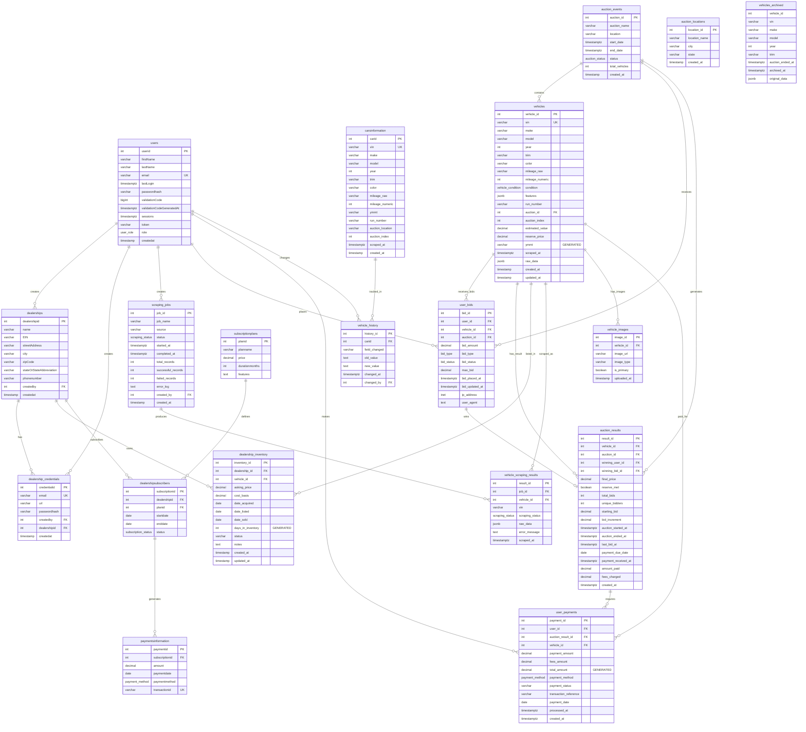

# Database Schema Diagram - Vehicle Auction Management System

## Entity Relationship Diagram



## Table Partitioning Strategy

```mermaid
graph TD
    A[user_bids] --> B[user_bids_2025_06]
    A --> C[user_bids_2025_07]
    A --> D[user_bids_2025_08]
    A --> E[user_bids_YYYY_MM...]

    F[auction_results] --> G[auction_results_2025_q2]
    F --> H[auction_results_2025_q3]
    F --> I[auction_results_2025_q4]
    F --> J[auction_results_YYYY_qN...]

    K[user_payments] --> L[user_payments_2025_06]
    K --> M[user_payments_2025_07]
    K --> N[user_payments_2025_08]
    K --> O[user_payments_YYYY_MM...]

    P[vehicles_archived] --> Q[vehicles_archived_2024]
    P --> R[vehicles_archived_2025]
    P --> S[vehicles_archived_YYYY...]
```



## Key Features

### 1. **Bidding System**
- Track all user bids with timestamps
- Support for different bid types (manual, auto, proxy)
- Real-time bid status tracking

### 2. **Auction Management**
- Complete auction lifecycle tracking
- Vehicle-to-auction relationships
- Final results and payment tracking

### 3. **Payment Processing**
- Detailed payment records
- Fee calculation and tracking
- Multiple payment methods support

### 4. **Data Partitioning**
- Monthly partitions for high-volume tables
- Quarterly partitions for analytical data
- Automated archive management

### 5. **Scalability Features**
- JSONB for flexible vehicle data
- Comprehensive indexing strategy
- Full-text search capabilities
- Automated partition management

## ENUM Types Used

```sql
-- User and system roles
CREATE TYPE user_role AS ENUM ('superAdmin', 'Admin', 'dealer');
CREATE TYPE user_status AS ENUM ('active', 'not active', 'revoked');

-- Auction and bidding
CREATE TYPE auction_status AS ENUM ('live', 'upcoming', 'completed', 'cancelled');
CREATE TYPE bid_type AS ENUM ('manual', 'auto', 'proxy', 'reserve');
CREATE TYPE bid_status AS ENUM ('active', 'outbid', 'winning', 'lost', 'withdrawn');

-- Vehicle condition
CREATE TYPE vehicle_condition AS ENUM ('excellent', 'good', 'fair', 'poor', 'salvage');

-- System operations
CREATE TYPE scraping_status AS ENUM ('pending', 'in_progress', 'completed', 'failed');
CREATE TYPE subscription_status AS ENUM ('active', 'expired', 'cancelled');
CREATE TYPE payment_method AS ENUM ('card', 'paypal', 'checking');
```

This database design provides a comprehensive solution for managing vehicle auctions with proper data lifecycle management, detailed bidding tracking, and scalable architecture.
